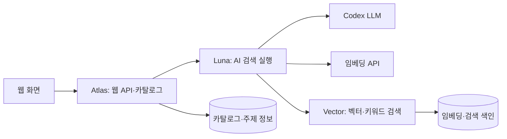

# 데이터이음 · Dataieum

**공공데이터를 자연어로 검색하고, 관련 자료와 공식 원문까지 연결하는 AI 에이전트입니다.**

- 서비스: [dataieum.com](https://dataieum.com/)
- 소스 저장소: [PPigicgi/dataieum](https://github.com/PPigicgi/dataieum)

사용자가 찾고 싶은 자료의 목적과 조건을 입력하면 AI가 검색 계획을 구성합니다. 검색 도구가 반환한 실제 후보를 검토하여 요청에 직접 맞는 자료와 함께 살펴볼 관련 자료를 구분하고, 자료 설명·제공기관·원문 링크를 보여줍니다. 연결 지도와 후속 질문으로 탐색을 이어갈 수 있습니다.

## 주요 기능

- **자연어 검색**: 질문에서 목적·국가·지역·기간 등의 조건을 해석합니다.
- **자료 검색과 추천**: 임베딩·키워드 검색, 후보 관련성 판단, 동일 계열 자료의 반복 노출 정리를 수행합니다.
- **연결 탐색**: 자료–주제 관계와 관련 개념을 따라 다른 자료를 찾습니다.
- **후속 질문과 작업 관리**: 이전 검색 조건의 변경사항을 반영하고 완료·취소·실패 상태를 관리합니다.
- **원문 안내**: 제공기관의 공식 페이지와 다운로드 경로를 제공합니다. 파일 다운로드와 이용조건 확인은 제공기관 페이지에서 진행합니다.

## 시스템 구조

웹/API를 담당하는 **Atlas**, AI 검색을 담당하는 **Luna**, 벡터 검색을 담당하는 **Vector**로 역할이 나뉩니다. 이 저장소에는 각 운영 컨테이너에서 추출한 담당 코드를 함께 정리했습니다.



대표 검색 흐름은 다음과 같습니다.

1. 질문의 목적과 조건을 해석하고 이전 검색 계획의 변경사항을 반영합니다.
2. 검색 주제·필터를 정규화합니다. 조건이 부족하면 추가 질문을 반환합니다.
3. 검색 임베딩을 생성하고 실제 자료 후보를 조회합니다.
4. 후보의 설명과 조건 근거를 검토하여 직접 관련 자료와 주변 자료를 구분합니다.
5. 자료 ID·응답 형식·출처 등 결과 계약을 검증하고, 화면에서 결과와 후속 탐색 경로를 제공합니다.

LangGraph는 단계의 순서와 분기를 연결합니다. 모델 호출·도구 실행의 시간과 자원 한도는 `Harness`가 관리하고, 웹의 검색 작업 상태는 별도 저장소에서 관리합니다. 벡터 검색 설정 유무에 따라 실행 경로가 달라집니다.

## 코드 구성과 읽는 순서

| 경로 | 역할 |
| --- | --- |
| [`discovery_harness/dataieum.py`](discovery_harness/dataieum.py) | 웹 요청 처리, 카탈로그와 AI 게이트웨이 연결, ASGI 앱 생성 |
| [`experiments/luna_discovery.py`](experiments/luna_discovery.py) | AI 검색 게이트웨이 실행과 모델·검색 도구 통합 |
| [`experiments/site_workflow.py`](experiments/site_workflow.py) | 질문 해석 → 정규화 → 검색 → 관련성 판단 → 결과 검증의 LangGraph 흐름 |
| `discovery_harness/site_search.py`, `relevance.py`, `related_suggestions.py` | 검색 조건, 후보 관련성, 관련 자료 추천 처리 |
| `discovery_harness/vector_tools.py`, `vector_server.py`, `vector_index.py` | 임베딩 호출, 내부 검색 API, FAISS 색인·검색 |
| `discovery_harness/dataset_series.py` | 같은 계열·시계열 자료의 반복 노출 처리 |
| `discovery_harness/native_catalog.py`, `postgres_catalog.py` | 카탈로그·메타데이터 조회와 PostgreSQL 연결 |
| `discovery_harness/topic_graph.py`, `topic_explorer.py`, `topic_api.py` | 자료–주제 연결과 탐색 API |
| `discovery_harness/chat_jobs.py`, `runtime.py`, `policy.py` | 검색 작업 상태, 실행 제어, 자원·시간 정책 |
| `discovery_harness/codex_luna.py`, `luna_appserver.py` | Codex 실행 및 app-server 기반 모델 호출 |
| `discovery_harness/web/` | 웹 화면에 사용하는 정적 스크립트·스타일·HTML |
| `frontend/` | 운영 이미지의 프런트엔드 빌드 결과물 |
| `catalog.py`, `collectors.py`, `registry.py`, `classification_batch.py`, `embedding_batch.py` | 자료 수집·등록·분류·임베딩 배치 처리 |
| `operations/` | 배포, 데이터 갱신, PostgreSQL 구성, 백업·유지관리 |

전체 동작을 파악하려면 `dataieum.py` → `luna_discovery.py` → `site_workflow.py` → `vector_tools.py`·`vector_index.py` 순서로 읽는 것을 권장합니다. `experiments/`에는 현재 AI 검색 실행에 사용되는 코드도 포함되어 있습니다.

## 기술과 의존성

| 구분 | 사용 기술 |
| --- | --- |
| 서버 | Python, ASGI, Uvicorn, FastAPI |
| AI 실행 | Codex 실행기 / app-server, LangGraph |
| 질문 해석·관련성 판단 | 코드의 기본 모델 식별자 `gpt-5.6-luna` |
| 임베딩·검색 | `text-embedding-3-small`, FAISS, NumPy, 키워드 검색 |
| 저장소 | PostgreSQL 메타데이터, SQLite 카탈로그·파생 색인·작업 상태 |
| HTTP·계측 | HTTPX, OpenTelemetry |

`requirements.txt`는 추출한 이미지에 포함된 의존성 목록입니다. AI·벡터 서비스까지 모두 재구성하는 통합 잠금 파일은 아닙니다. `site_workflow.py`에는 `langgraph`·`langsmith`, `vector_index.py`에는 `faiss`·`numpy`가 추가로 필요하며 서비스 환경에 맞는 호환 버전을 준비해야 합니다. FAISS의 CPU용 Python 배포 패키지명은 `faiss-cpu`입니다.

운영 서버의 자원 계측은 Linux 환경을 전제로 합니다. 아래 CLI 확인은 Python 3.12에서 수행했으며, Windows에서 전체 운영 환경을 재현한 검증은 아닙니다.

## 소스 확인과 의존성 준비

저장소 루트에서 실행합니다. 아래는 Linux/Bash 기준입니다.

```bash
python3 -m venv .venv
source .venv/bin/activate
python -m pip install -r requirements.txt
```

AI 검색·벡터 검색을 실행하려면 위 표의 추가 의존성과 다음 절의 데이터·설정을 별도로 준비해야 합니다. `frontend/`는 이미 빌드된 산출물이므로 원래 React/TypeScript 프로젝트의 재빌드 절차를 제공하는 폴더는 아닙니다.

준비된 Python 환경에서 다음 명령으로 실제 실행 인자를 확인할 수 있습니다.

```bash
python -B -m experiments.luna_discovery --help
python -B -m discovery_harness.vector_server --help
python -B -m discovery_harness.vector_index --help
```

세 명령의 도움말 출력과 종료 코드 0을 확인했습니다. `serve_dataieum.py`에는 `--help` 옵션이 없으며, 모듈을 실행하면 서버가 시작됩니다.

## 서비스 실행에 필요한 설정

공개 소스에는 운영 DB, 임베딩·검색 색인, 인증정보, 배포 정책 파일이 포함되어 있지 않습니다. 다음은 **해당 데이터와 설정을 이미 준비한 환경에서 사용하는 실행 진입점**입니다. 빈 저장소에서 전체 서비스를 자동 구축하는 명령은 아닙니다.

### 1. Atlas — 웹/API

[`dataieum.create_app()`](discovery_harness/dataieum.py)이 읽는 주요 환경변수입니다.

| 변수 | 내용 |
| --- | --- |
| `DATAIEUM_SOURCE_DIR` | 이 저장소의 루트 경로. 기본값 `/app` |
| `DB_PATH` | 기존 카탈로그 SQLite 파일 경로. 필수 |
| `DATAIEUM_FRONTEND_DIR` | `index.html`이 있는 빌드 디렉터리. 기본값 `/app/frontend` |
| `HARNESS_POLICY_FILE` | 실행·자원 정책 JSON 경로. 기본값 `/harness-config/policy.json` |
| `HARNESS_WORKSPACE` | 작업용 디렉터리. 기본값 `/harness-workspace` |
| `DATAIEUM_CHAT_GATEWAY` | Luna 내부 HTTP 주소. 예: `http://127.0.0.1:8091` |
| `DATAIEUM_CHAT_GATEWAY_TOKEN_FILE` | Luna와 공유하는 게이트웨이 토큰 파일. 채팅 연결 시 필요 |
| `DATAIEUM_CHAT_JOBS` | `1`이면 검색 작업 큐·상태 저장 사용 |
| `DATAIEUM_JOBS_PATH` | 검색 작업 상태 SQLite 파일 경로 |
| `DATAIEUM_POSTGRES_CONFIG`, `DATAIEUM_PUBLICATION_FILE` | PostgreSQL 사용 시 접속 설정과 검증된 게시 버전 정보 경로 |
| `DATAIEUM_TOPIC_GRAPH` | 주제 연결 데이터 경로 |

정책의 항목과 검증 규칙은 [`policy.py`](discovery_harness/policy.py)에 있습니다. 서버 정책을 활성화해야 하며, 카탈로그·제어 상태·작업 디렉터리는 서로 분리하고 코드에서 요구하는 동일 파일시스템 조건을 충족해야 합니다. 자원 한도와 실제 디스크·메모리 조건도 함께 검증됩니다.

환경변수를 설정한 뒤 웹 앱을 로컬 인터페이스에서 시작하는 예시입니다.

```bash
python -m uvicorn discovery_harness.dataieum:create_app \
  --factory --host 127.0.0.1 --port 8000 --workers 1
```

운영용 연결 제한 처리가 포함된 별도 진입점은 `python -m discovery_harness.serve_dataieum`입니다. 이 진입점은 `0.0.0.0:8000`에 바인딩하므로 기존 배포의 접근 제어와 네트워크 설정을 전제로 사용합니다.

### 2. Vector — 벡터 검색

카탈로그와 대응하는 임베딩 DB, FAISS 색인 디렉터리, 게이트웨이 토큰 파일이 필요합니다. 파일 경로는 실제 준비한 데이터의 경로로 바꿉니다.

```bash
python -m discovery_harness.vector_server \
  --host 127.0.0.1 --port 8093 \
  --catalog /path/to/catalog.sqlite3 \
  --embeddings /path/to/embeddings.sqlite3 \
  --index /path/to/vector-index \
  --token-file /path/to/gateway.token
```

색인 생성 진입점은 `python -m discovery_harness.vector_index build --help`에서 확인할 수 있습니다. 색인과 임베딩·카탈로그의 출처 정보가 일치해야 하며, 임의 형식의 CSV나 벡터 파일을 그대로 넣는 인터페이스는 아닙니다.

### 3. Luna — AI 검색

로그인과 모델 접근이 가능한 Codex 실행 파일, 동작 중인 Atlas, 쓰기 가능한 상태 디렉터리가 필요합니다. 상태 디렉터리의 `gateway.token`은 Atlas·Vector와 공유하는 64자리 소문자 16진수 토큰 파일입니다.

```bash
python -m experiments.luna_discovery \
  --codex /path/to/codex \
  --catalog-url http://127.0.0.1:8000 \
  --host 127.0.0.1 --port 8091 \
  --state /path/to/luna-state \
  --transport shared
```

`--catalog-url`의 기본 포트는 8090이므로 위 예시에서는 Atlas의 8000을 명시했습니다. `--transport shared`는 Codex app-server를 사용합니다.

벡터 검색을 연결하려면 Luna 상태 디렉터리에 다음 형태의 `vector.json`을 준비합니다. `key_file`은 임베딩 API 키를 별도 파일로 주입하는 경로입니다.

```json
{
  "enabled": true,
  "key_file": "/path/to/embedding-api-key.txt"
}
```

Luna에서 `DATAIEUM_VECTOR_URL`로 Vector 주소를 설정합니다. 기본값은 `http://127.0.0.1:8093`입니다. 실제 키·토큰·로그인 파일은 저장소에 넣지 않습니다.

### 준비 상태 확인

각 서비스를 시작한 환경에서 다음 경로로 준비 상태를 확인합니다.

```bash
curl http://127.0.0.1:8000/health/ready
curl http://127.0.0.1:8091/health/ready
curl http://127.0.0.1:8093/health/ready
```

준비 상태 확인 후 웹 화면에서 검색을 실행하여 모델·검색·결과 표시까지 확인해야 합니다. 이 README 수정 과정에서는 CLI 도움말과 코드의 진입점·설정 항목을 확인했으며, 새 환경의 의존성 설치부터 전체 서비스 기동까지 재현하지는 않았습니다.

## 공개 범위와 기능 상태

이 저장소는 2026년 10월 6일 운영 Docker 컨테이너에서 추출한 소스 사본입니다. 기존 검색·카탈로그·연결 지도 기반과 **2026.10.01.~10.06. 제출 버전의 개발·개선**이 함께 포함되어 있습니다. 이 기간과 추출 날짜는 서비스 전체의 최초 개발일을 뜻하지 않습니다. 기존 Git 작업 이력은 배포 사본에 포함하지 않았으며, 소스의 날짜·버전·출처 표기는 보존했습니다.

- 포함: 웹/API, 검색·관련성 판단, 주제 탐색, 상태 관리, 수집·운영 코드와 프런트엔드 빌드 결과물.
- 별도 준비: 운영 DB·색인, 계정·API 키, 실제 문의 수신처, 정책·배포 설정, 프런트엔드 원본 프로젝트.
- 문의·메일 관련 코드는 포함되어 있으나 공개 기준의 실제 발송은 비활성 상태입니다.
- 원자료의 오류·누락·품질 검사(QA)는 향후 확장 계획입니다.

파일별 추출 출처와 SHA-256은 [SOURCE_MANIFEST.json](SOURCE_MANIFEST.json), 공개 사본에서 접속정보·개인 경로를 정리한 내역은 [PUBLIC_EXPORT_NOTES.md](PUBLIC_EXPORT_NOTES.md)에 있습니다. `operations/`에는 원격 배포·갱신·정리 작업이 있으므로 소스 확인용 명령과 구분해서 사용해야 합니다.

## 출처와 라이선스

LangGraph, FAISS, FastAPI, NumPy, HTTPX 등 외부 라이브러리는 각 프로젝트의 라이선스를 따릅니다. 프런트엔드 빌드에 포함된 React·React DOM·Scheduler의 버전과 MIT 고지 전문은 [THIRD_PARTY_NOTICES.md](THIRD_PARTY_NOTICES.md)에 있습니다.

공공데이터의 이용조건은 각 제공기관의 원문을 따릅니다. 코드 공개가 연결된 원자료의 재배포 권한을 부여하는 것은 아닙니다. 자체 코드에 새로운 오픈소스 라이선스를 임의로 지정하지 않았습니다.
