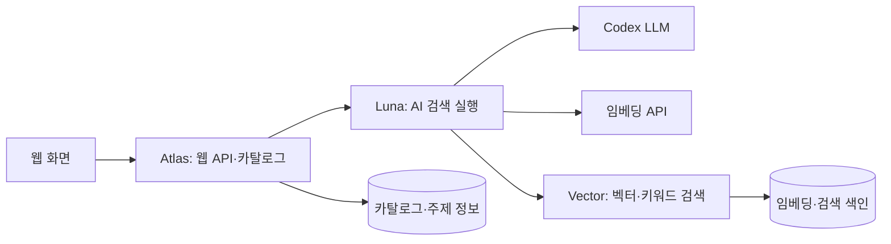

# 데이터이음 · Dataieum

**공공데이터를 자연어로 검색하고, 관련 자료와 공식 원문까지 연결하는 AI 에이전트입니다.**

- 서비스: [dataieum.com](https://dataieum.com/)

사용자가 찾고 싶은 자료의 목적과 조건을 입력하면 AI가 검색 계획을 구성합니다. 검색 도구가 반환한 실제 후보를 검토하여 요청에 직접 맞는 자료와 함께 살펴볼 관련 자료를 구분하고, 자료 설명·제공기관·원문 링크를 보여줍니다. 연결 지도와 후속 질문으로 탐색을 이어갈 수 있습니다.

## 주요 기능

- **자연어 검색**: 질문에서 목적·국가·지역·기간 등의 조건을 해석합니다.
- **자료 검색과 추천**: 임베딩·키워드 검색, 후보 관련성 판단, 동일 계열 자료의 반복 노출 정리를 수행합니다.
- **연결 탐색**: 자료–주제 관계와 관련 개념을 따라 다른 자료를 찾습니다.
- **후속 질문과 작업 관리**: 이전 검색 조건의 변경사항을 반영하고 완료·취소·실패 상태를 관리합니다.
- **원문 안내**: 제공기관의 공식 페이지와 다운로드 경로를 제공합니다. 파일 다운로드와 이용조건 확인은 제공기관 페이지에서 진행합니다.

## 시스템 구조

웹/API를 담당하는 **Atlas**, AI 검색을 담당하는 **Luna**, 벡터 검색을 담당하는 **Vector**로 역할이 나뉩니다. 이 저장소에는 각 운영 컨테이너에서 추출한 담당 코드를 함께 정리했습니다.

대표 검색 흐름은 다음과 같습니다.

1. 질문의 목적과 조건을 해석하고 이전 검색 계획의 변경사항을 반영합니다.
2. 검색 주제·필터를 정규화합니다. 조건이 부족하면 추가 질문을 반환합니다.
3. 검색 임베딩을 생성하고 실제 자료 후보를 조회합니다.
4. 후보의 설명과 조건 근거를 검토하여 직접 관련 자료와 주변 자료를 구분합니다.
5. 자료 ID·응답 형식·출처 등 결과 계약을 검증하고, 화면에서 결과와 후속 탐색 경로를 제공합니다.

LangGraph는 단계의 순서와 분기를 연결합니다. 모델 호출·도구 실행의 시간과 자원 한도는 `Harness`가 관리하고, 웹의 검색 작업 상태는 별도 저장소에서 관리합니다. 벡터 검색 설정 유무에 따라 실행 경로가 달라집니다.

## 코드 구성과 읽는 순서

| 경로 | 역할 |
| --- | --- |
| [`discovery_harness/dataieum.py`](discovery_harness/dataieum.py) | 웹 요청 처리, 카탈로그와 AI 게이트웨이 연결, ASGI 앱 생성 |
| [`experiments/luna_discovery.py`](experiments/luna_discovery.py) | AI 검색 게이트웨이 실행과 모델·검색 도구 통합 |
| [`experiments/site_workflow.py`](experiments/site_workflow.py) | 질문 해석 → 정규화 → 검색 → 관련성 판단 → 결과 검증의 LangGraph 흐름 |
| `discovery_harness/site_search.py`, `relevance.py`, `related_suggestions.py` | 검색 조건, 후보 관련성, 관련 자료 추천 처리 |
| `discovery_harness/vector_tools.py`, `vector_server.py`, `vector_index.py` | 임베딩 호출, 내부 검색 API, FAISS 색인·검색 |
| `discovery_harness/dataset_series.py` | 같은 계열·시계열 자료의 반복 노출 처리 |
| `discovery_harness/native_catalog.py`, `postgres_catalog.py` | 카탈로그·메타데이터 조회와 PostgreSQL 연결 |
| `discovery_harness/topic_graph.py`, `topic_explorer.py`, `topic_api.py` | 자료–주제 연결과 탐색 API |
| `discovery_harness/chat_jobs.py`, `runtime.py`, `policy.py` | 검색 작업 상태, 실행 제어, 자원·시간 정책 |
| `discovery_harness/codex_luna.py`, `luna_appserver.py` | Codex 실행 및 app-server 기반 모델 호출 |
| `discovery_harness/web/` | 웹 화면에 사용하는 정적 스크립트·스타일·HTML |
| `frontend/` | 운영 이미지의 프런트엔드 빌드 결과물 |
| `catalog.py`, `collectors.py`, `registry.py`, `classification_batch.py`, `embedding_batch.py` | 자료 수집·등록·분류·임베딩 배치 처리 |
| `operations/` | 배포, 데이터 갱신, PostgreSQL 구성, 백업·유지관리 |

전체 동작을 파악하려면 `dataieum.py` → `luna_discovery.py` → `site_workflow.py` → `vector_tools.py`·`vector_index.py` 순서로 읽는 것을 권장합니다. `experiments/`에는 현재 AI 검색 실행에 사용되는 코드도 포함되어 있습니다.
